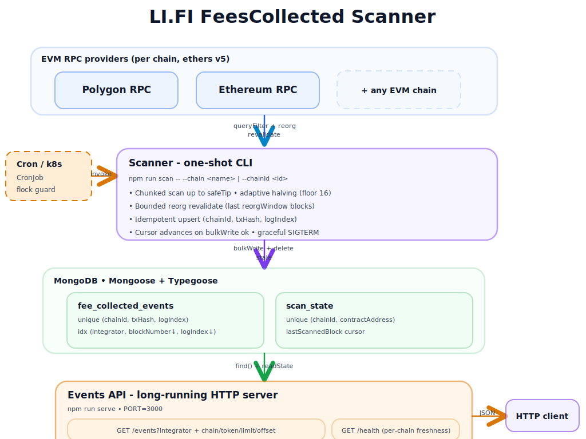

# LI.FI `FeesCollected` Scanner and Events API

A TypeScript scanner and REST API that pulls `FeesCollected` events from LI.FI's `FeeCollector` contract on Polygon and Ethereum, persists them to MongoDB via Typegoose, and resumes idempotently across restarts. New EVM chains are added through `src/chains.ts`.

## What it does

- **Scanner**: one-shot CLI. Default chain is `polygon`. Walks the chain in chunks and writes events to MongoDB.
- **Events API**: long-running HTTP server on `PORT` (default `3000`). `GET /events?integrator=<addr>` and `GET /health`. Optional filters: `chain`, `chainId`, `contractAddress`, `token`.

Both are independent processes against the same MongoDB.

---

## Quickstart with Docker

```bash
cp .env.example .env
# Optional: swap public RPCs for archive-capable URLs (needed for cold-start scans).
docker compose -p smart_contract_events up --build
```

`docker compose up` starts three services:

- `mongodb`
- `events-api` on `http://localhost:3000`
- `fees-scanner`, once, with `--chain polygon`

A plain Compose start populates MongoDB from Polygon by default. The scanner exits after it catches up; the API and MongoDB stay running.

To scan Ethereum on demand:

```bash
docker compose -p smart_contract_events run --rm fees-scanner --chain ethereum
```

Health and query examples:

```bash
curl -s http://localhost:3000/health
curl -s 'http://localhost:3000/events?integrator=<known-integrator>&limit=5'
```

---

## Local usage

```bash
npm install
cp .env.example .env
npm run build
npm test
```

Scanning requires real RPC URLs in `.env` and a local MongoDB reachable at `MONGODB_URI`.

```bash
npm run scan -- --chain polygon
npm run serve
```

Collections and indexes are created on demand by the scanner. No manual DB bootstrap.

---

## Configuration

| Env var            | Required | Notes                                                                                                             |
| ------------------ | -------- | ----------------------------------------------------------------------------------------------------------------- |
| `MONGODB_URI`      | yes      | `mongodb://...` or `mongodb+srv://...`. In Docker, override per-service to `mongodb://mongodb:27017/lifi_events`. |
| `POLYGON_RPC_URL`  | yes\*    | Required when scanning Polygon.                                                                                   |
| `ETHEREUM_RPC_URL` | yes\*    | Required when scanning Ethereum.                                                                                  |
| `LOG_LEVEL`        | no       | Default `info`. `debug` for per-chunk logs.                                                                       |
| `PORT`             | no       | API listen port. Default `3000`.                                                                                  |
| `NODE_ENV`         | no       | `development` (pretty logs) or `production` (JSON logs). Default `development`.                                   |

\* Required only for the selected `--chain`.

**RPC archive note**: public RPCs in `.env.example` are fine for live tail but often prune old history. Cold-start scans from the documented `startBlock` need an archive-capable provider URL.

`chunkSize`, `confirmations`, `reorgWindow`, and `rpcTimeoutMs` live on `ChainConfig` in `src/chains.ts` (not env vars).

To add a new EVM chain, see [`docs/ADDING_CHAIN.md`](docs/ADDING_CHAIN.md).

---

## Architecture



- **RPC providers** per chain (ethers v5).
- **Scanner CLI** runs once per invocation.
- **MongoDB** stores `fee_collected_events` (unique on `chainId, txHash, logIndex`) and `scan_state` (cursor per `chainId, contractAddress`).
- **Events API** is long-running and reads persisted rows.

For the full module layout and data model details, see [`docs/SCANNER.md`](docs/SCANNER.md).

---

## Scanner behavior

- One-shot CLI. Each invocation scans from the stored cursor up to `safeTip = currentBlock - confirmations` and exits.
- Idempotent upsert on `(chainId, txHash, logIndex)`. Re-running the same range is a no-op.
- Cursor advances only after `bulkWrite` succeeds.
- Adaptive chunk halving on RPC range-too-large errors, floor 16 blocks.
- Bounded reorg revalidation over the last `reorgWindow` blocks at the start of every run.
- Graceful SIGTERM/SIGINT: the in-flight chunk completes before exit.

Internals: [`docs/SCANNER.md`](docs/SCANNER.md). Trade-offs and rationale: [`docs/DESIGN.md`](docs/DESIGN.md).

---

## API

`GET /events?integrator=<addr>` with optional filters `chain`, `chainId`, `contractAddress`, `token`, `limit`, `offset`.

```bash
curl -s 'http://localhost:3000/events?integrator=0x1111111111111111111111111111111111111111&chain=polygon&limit=25'
```

Response:

```json
{
  "data": [
    {
      "chainId": 137,
      "txHash": "0x...",
      "logIndex": 0,
      "blockNumber": 78600100,
      "blockHash": "0x...",
      "contractAddress": "0xbd6c7b0d2f68c2b7805d88388319cfb6ecb50ea9",
      "token": "0x...",
      "integrator": "0x...",
      "integratorFee": "1000000",
      "lifiFee": "200000"
    }
  ],
  "pagination": { "limit": 50, "offset": 0, "returned": 1 }
}
```

`GET /health` returns scan freshness per `(chainId, contractAddress)` and `503` if MongoDB is disconnected.

Error codes: `INVALID_ADDRESS`, `INVALID_PAGINATION`, `INVALID_CHAIN`, `INTERNAL_ERROR`.

Full parameter rules, all curl examples, sort order, and pagination caveats: [`docs/API.md`](docs/API.md).

---

## Testing

```bash
npm run test:unit         # unit tests, no external dependencies
npm run test:integration  # integration tests, uses mongodb-memory-server
npm test                  # full suite
npm run test:coverage     # full suite with coverage report
```

`npm test` does not require RPC or network access. Fixture re-capture notes live in `tests/fixtures/README.md`.

---

## Operations and security

- Scanner is one-shot. Continuous updates use cron, GitHub Actions, or Kubernetes CronJob. Run one scanner per `(chainId, contractAddress)`.
- The events collection is reconstructable by re-running the scanner from `startBlock`. MongoDB replica set is not required.
- The Events API has no authentication, TLS, or rate limiting and is intended for internal or private-network use only. Public exposure belongs behind an upstream gateway. MongoDB is not intended for public exposure.
- Full `MONGODB_URI` and RPC URLs may contain credentials. `.env` remains gitignored and real provider secrets stay out of commits.

For failure-mode checks see [`docs/RUNBOOK.md`](docs/RUNBOOK.md). For freshness, availability, latency, and integrity targets see [`docs/SLO.md`](docs/SLO.md).

---

## Future work

- Multi-RPC failover and cross-provider verification for suspicious ranges.
- Per-chain finality model (Ethereum finalized blocks where supported, L2-specific rules).
- `blockTimestamp` per event (batched `getBlock`, persisted alongside each row).
- `fromBlock` and `toBlock` query filters for backfill exports and time-window analytics.
- Fee summary endpoint: totals by integrator, token, chain, or block/timestamp range.
